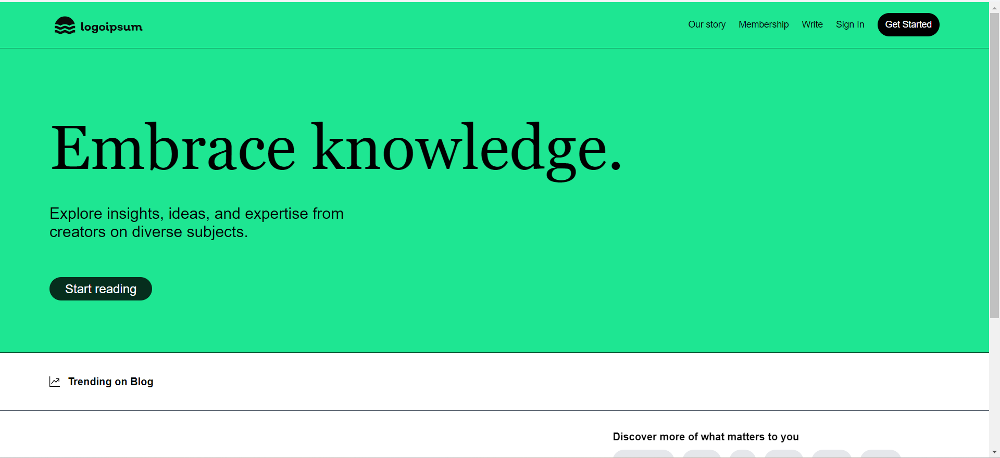

## Blog website using React JS, Tailwind css, Firebase.

## Features

- CRUD Post
- User Profile
- Follow Unfollow User
- CRUD Comment
- Authentication
- Search Post
- Filter Post

## Description
The blog application is a dynamic platform where users can create, edit, and manage their own blog posts. The application features a modern, responsive design and is built using React.js, with Firebase handling user authentication and Redux Toolkit managing the state of the blog posts. Users can easily sign up, log in, and start sharing their thoughts through blog posts that include a title, description, and cover image. Each post can be updated or deleted by its creator, ensuring that users have full control over their content. The application also provides a seamless reading experience, allowing visitors to browse through posts and read full articles on dedicated pages.

## Usage
Homepage: View a list of all blog posts.

Single Blog Page: Click on a blog title to view the full post.

Login/Signup: Users must log in to add, edit, or delete posts.

Add Blog: Use the form to submit a new blog post.

Edit Blog: Edit existing blog posts by clicking the edit button.

Delete Blog: Remove your blog posts using the delete button.

## Technologies 

- [React JS](https://reactjs.org/docs/getting-started.html)
- [Firebase](https://firebase.google.com/?gad_source=1&gclid=Cj0KCQiA-62tBhDSARIsAO7twbZfIBRLkw-1Uz_ygeLOlRmiqz8ZkAsPf0ETsiUBLuYPhWbq4AKo6YcaApWAEALw_wcB&gclsrc=aw.ds)
- [Tailwind css](https://tailwindcss.com/)
